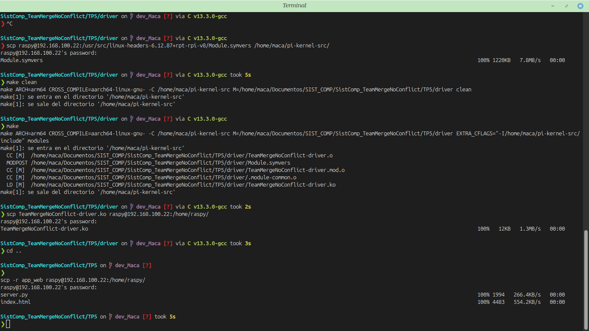

# Informe: Trabajo Práctico #5 - Devices Drivers

**Asignatura:** Sistemas de Computación  
**Institución:** Facultad de Ciencias Exactas, Físicas y Naturales (FCEFyN) – UNC  
**Docente:** Javier Alejandro Jorge  

## Datos del Grupo y Repositorio

* **Integrantes:** - Macarena Vanina González 
  - Marcos Nieto 
  - Mario Pampiglione
* **Repositorio:** [https://github.com/Maca040/SistComp_TeamMergeNoConflict.git](https://github.com/Maca040/SistComp_TeamMergeNoConflict.git)

---

## 1. Objetivo del Trabajo Práctico

El objetivo principal de este trabajo práctico es desarrollar un controlador de dispositivos de caracteres (CDD) para Linux, diseñado para interactuar con puertos GPIO y leer dos señales externas tomando una muestra por segundo. Debido a desperfectos técnicos con el hardware físico durante la etapa de desarrollo, la ejecución y validación del driver se realiza sobre una máquina virtual emulada mediante QEMU (utilizando la herramienta `qemu-rpi-gpio`), la cual simula perfectamente la arquitectura y los pines de una Raspberry Pi.

A pesar de utilizar un entorno emulado, se aplica *cross-compilation* (compilación cruzada). En lugar de programar y compilar todo dentro de la máquina virtual, configuramos nuestro entorno para escribir y compilar el código fuente en nuestra PC anfitriona (arquitectura x86_64). Una vez generado el módulo del kernel, lo transferimos a la máquina virtual emulada (arquitectura ARM) mediante SSH para su ejecución.

Finalmente, para la visualización de los datos, decidimos descartar el uso de aplicaciones de escritorio pesadas para no consumir recursos innecesarios en el entorno emulado. En su lugar, implementamos una aplicación web ligera usando Python y Flask. Esta interfaz nos permite enviarle comandos al driver para elegir qué señal simular y ver cómo se grafica en tiempo real directamente desde el navegador de nuestra computadora anfitriona.

---

## 2. Marco Teórico y Arquitectura

### Character Device Driver (CDD)
Los dispositivos en Linux se clasifican en bloques, caracteres y red. Un CDD es el tipo apropiado para dispositivos que producen o consumen datos de forma continua y secuencial. El kernel los expone al espacio de usuario como archivos especiales en `/dev`, permitiendo interactuar con ellos usando llamadas estándar del sistema operativo como `open()`, `read()`, `write()` y `close()`. Cada dispositivo de caracteres se identifica con un número MAJOR (que identifica al driver) y un número MINOR (que identifica al dispositivo concreto).

### Entorno de Emulación y Cross-Compilation
La compilación cruzada implica compilar código fuente en una arquitectura anfitriona para ejecutarlo en una diferente. En este proyecto, el host es una PC con Linux (x86_64) y el target es una Raspberry Pi emulada en QEMU (máquina `versatilepb`, CPU ARM1176). Para lograr esto, se utilizó el compilador `arm-linux-gnueabihf-gcc` y se prepararon los *kernel headers* de la versión exacta (`5.10.63`) en la máquina anfitriona.

---

## 3. Implementación del Driver y Simulación de Señales

Ante la falta del hardware físico, el driver fue adaptado para generar señales lógicas de forma virtual utilizando el contador global de ticks del reloj del kernel de Linux, conocido como `jiffies`. La constante `HZ` indica cuántos ticks ocurren por segundo, lo que nos permitió crear las señales sin necesidad de interrupciones externas:

* **Señal 1 (1 Hz):** Cambia de estado cada segundo calculando `(jiffies / HZ) % 2`.
* **Señal 2 (2 Hz):** Cambia de estado cada medio segundo calculando `(jiffies / (HZ / 2)) % 2`.
* **Protección de Memoria ARM:** Debido a la arquitectura de dominios de memoria en QEMU, las funciones clásicas `copy_to_user` generaban un fallo de dominio de página (*page domain fault*). Para solucionarlo y transferir datos de forma segura, se utilizaron las funciones `simple_read_from_buffer()` y `simple_write_to_buffer()` provistas por `<linux/fs.h>`.

**Verificación del Módulo en el Kernel:**
En la siguiente captura se comprueba la correcta carga del driver en memoria (`lsmod`), la asignación dinámica del número MAJOR (`cat /proc/devices`), la creación del nodo en `/dev` y la metadata del módulo cruzado (`modinfo`):


---

## 4. Flujo de Trabajo y Despliegue

El ciclo de desarrollo e implementación consistió en compilar el módulo en el Host y transferirlo a la máquina emulada mediante una conexión SSH redirigida al puerto 5022 de QEMU. 

Los comandos exactos utilizados para la transferencia y ejecución fueron los siguientes:

**En la PC Host (Compilación y Transferencia):**
```bash
# Limpiar y compilar el módulo cruzado
make clean
make

# Enviar los archivos a la máquina virtual
scp -P 5022 TeamMergeNoConflict-driver.ko pi@localhost:~/
scp -P 5022 -r app_web pi@localhost:~/
```
**En la Máquina Virtual (Carga y Ejecución):**

```bash
# Cargar el módulo en el kernel
sudo insmod TeamMergeNoConflict-driver.ko

# Otorgar permisos de lectura/escritura al archivo del dispositivo
sudo chmod 666 /dev/TeamMergeNoConflict

# Navegar a la carpeta de la aplicación web
cd app_web

# Ejecutar el servidor Flask utilizando las dependencias portables
PYTHONPATH=~/flask-portable python3 server.py
```



---
## 5. Aplicación de Usuario (Servidor Web)

La aplicación actúa como puente entre el navegador del host y el driver en la máquina virtual utilizando el framework Flask (Python). Cumple dos funciones principales:

* **Lectura Continua:** Cada 250 ms, el cliente solicita datos. El servidor abre el archivo virtual del dispositivo utilizando lectura binaria sin buffer (`open(path, 'rb', buffering=0)`) para forzar una única llamada `read(1)` al driver y evitar un *kernel panic* causado por la lectura en bloques predeterminada de Python.
* **Selección de Señal:** Al interactuar con la interfaz web, el sistema ejecuta una escritura (`write`) en el driver para indicarle qué señal debe comenzar a procesar, reseteando el gráfico dinámico generado con Chart.js en el frontend.

**Visualización de las señales en tiempo real:**
A continuación se observa la interfaz cliente-servidor renderizando la "Señal 1" (1 Hz) y la "Señal 2" (2 Hz) simuladas por el CDD, con el eje de tiempo iniciando desde cero al cambiar de estado:


---

## 6. Conclusión

Este trabajo práctico permitió experimentar de primera mano el flujo completo de desarrollo de un Character Device Driver para Linux bajo el paradigma de compilación cruzada, adaptándose exitosamente a un entorno de hardware emulado tras sufrir fallas en la placa física. 

La resolución de errores de bajo nivel (como incompatibilidades de *version magic*, símbolos faltantes y fallos en dominios de memoria ARM) demostró que programar en el kernel requiere una profunda comprensión de la arquitectura del sistema y del entorno de compilación. Finalmente, la implementación de una arquitectura web ligera validó la importancia de optimizar los recursos en sistemas embebidos, logrando un monitoreo en tiempo real eficiente y estable.


